# 📊 Dashboard Principal - CotareloManage

Centro de control y monitoreo para la gestión educativa.

---

## 🎯 **Visión General**

El **dashboard principal de CotareloManage** es el corazón del sistema, proporcionando una vista consolidada de toda la actividad educativa en tiempo real.

---

## 🚀 **Características Principales**

- 📈 Métricas en tiempo real  
- 📊 Gráficos interactivos y personalizables  
- 🔔 Alertas y notificaciones inteligentes  
- ⚡ Acceso rápido a funciones clave  
- 📱 Diseño responsive para todos los dispositivos  

---

## 📈 **Métricas Principales**

| KPI | Valor Actual | Objetivo | Tendencia |
|-----|---------------|-----------|------------|
| Estudiantes Activos | 1,247 | 1,500 | 📈 +5.2% |
| Asistencia Promedio | 87.3% | 90% | 📉 -1.1% |
| Calificaciones Subidas | 94.7% | 95% | 📈 +2.3% |
| Satisfacción Padres | 4.6/5 | 4.5/5 | 📈 +0.2 |

---

## 📊 **Widgets Disponibles**

### 🧮 Widget de Asistencia

```mermaid
pie title Distribución de Asistencia Semanal
"Presente" : 87
"Ausencia Justificada" : 8
"Ausencia Sin Justificar" : 4
"Tardanza" : 1
```



### 📚 Gráfico de Calificaciones

```mermaid
%%{init: {'xyChart': {'width': 700, 'height': 400}}}%%
xychart-beta
title "Distribución de Notas por Curso"
x-axis ["1º ESO", "2º ESO", "3º ESO", "4º ESO", "1º Bach", "2º Bach"]
y-axis "Nota Media" 0 --> 10
bar [7.2, 7.5, 7.1, 6.8, 8.1, 8.4]
```



---

## 🔔 **Sistema de Notificaciones**

### 🚨 Alertas Críticas
- Estudiante con más de 5 faltas consecutivas  
- Calificación inferior a 3.0  
- Incidencia disciplinaria grave  
- Sistema con problemas técnicos  

### ⚠️ Alertas Importantes
- Reunión de padres próxima  
- Entrega de notas pendiente  
- Evento escolar en 48 horas  
- Backup automático fallido  

---

## 👥 **Vista por Roles**

### 👨‍🎓 Dashboard del Estudiante
1. Próximas clases y horarios  
2. Calificaciones recientes  
3. Tareas pendientes  
4. Eventos y comunicados  
5. Progreso académico  

### 👩‍🏫 Dashboard del Profesor
- ✅ Resumen de sus clases  
- ✅ Lista de estudiantes  
- ✅ Calificaciones pendientes  
- ✅ Materiales educativos  
- ✅ Comunicaciones con padres  

### 🧑‍💼 Dashboard del Administrador
Vista completa del sistema (información sensible protegida).

---

## 🔐 **Permisos Granulares**

```json
{
  "roles": {
    "student": {
      "dashboard": ["view_own", "export_grades"],
      "widgets": ["grades", "schedule", "assignments"]
    },
    "teacher": {
      "dashboard": ["view_classes", "manage_grades"],
      "widgets": ["class_overview", "student_progress", "communications"]
    },
    "admin": {
      "dashboard": ["view_all", "system_metrics"],
      "widgets": ["*"]
    }
  }
}
```

---

💡 **Consejo:** Personaliza tu dashboard para mostrar solo la información que necesitas frecuentemente.  
👉 Más info: [docs.cotarelomanage.es/dashboard](https://docs.cotarelomanage.es/dashboard)
