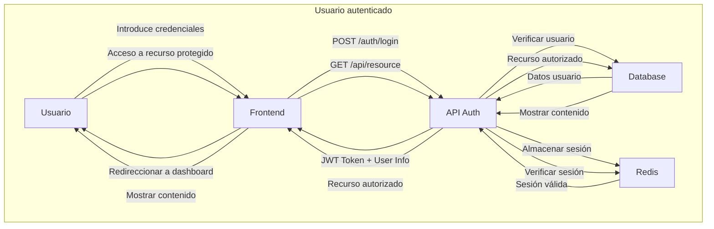

# 🔐 **Sistema de Autenticación - Login**

*Portal de acceso seguro para CotareloManage*

## 🎯 **Descripción del Módulo**

El sistema de login de CotareloManage proporciona autenticación segura mediante *JWT (JSON Web Tokens)* y soporta múltiples métodos de acceso.

## 🛡️ **Características de Seguridad**

- Encriptación AES-256 para contraseñas
- Tokens JWT con expiración automática
- Autenticación de dos factores (2FA) opcional
- Protección contra ataques de fuerza bruta
- Auditoría completa de accesos

## 🚪 **Métodos de Autenticación**

| **Método**       | **Disponibilidad** | **Seguridad** | **Facilidad** |
|-------------------|--------------------|---------------|---------------|
| Email/Password   | ✅ Siempre        | 🔒 Alta      | 😊 Fácil     |
| Google SSO       | ✅ Configurado    | 🔒🔒 Muy Alta | 😍 Muy Fácil |
| Microsoft SSO    | 🔄 Próximamente   | 🔒🔒 Muy Alta | 😍 Muy Fácil |
| LDAP/AD          | ⚙️ Empresarial   | 🔒🔒🔒 Máxima | 🤔 Técnica   |

## 👥 **Tipos de Usuario**

### 🎓 **Estudiantes**

Los estudiantes tienen acceso a:

1. Calificaciones y notas
2. Horarios de clase
3. Material educativo
4. Comunicación con profesores
5. Tareas y entregas

### 👩‍🏫 **Profesores**

Los profesores pueden:

✅ Gestionar sus clases  
✅ Subir calificaciones  
✅ Comunicarse con estudiantes y padres  
✅ Crear contenido educativo  
✅ Generar reportes académicos

### 🛠️ **Administradores**

Los administradores tienen control total:

> *Importante: Los permisos de administrador deben asignarse con extrema precaución.*

🔧 Gestión completa de usuarios  
🔧 Configuración del sistema  
🔧 Backup y restauración  
🔧 Monitoreo y estadísticas  
🔧 Soporte técnico

## 🔄 **Flujo de Autenticación**

## 📊 **Estadísticas de Uso**

### ⏰ **Horarios de Mayor Actividad**

Los picos de login se producen:

1. 8:00-9:00 AM - Inicio de clases
2. 2:00-3:00 PM - Después del almuerzo
3. 7:00-8:00 PM - Estudios en casa
4. 10:00-11:00 PM - Revisión final

### 📱 **Dispositivos Más Utilizados**

- 📱 Móvil: 45%
- 💻 Ordenador: 35%
- 📱 Tablet: 15%
- 🖥️ Desktop: 5%

## 🛡️ **Seguridad y Soporte**

*Nunca compartas tus credenciales. CotareloManage nunca te pedirá tu contraseña por email.*  
¿Problemas de acceso? Usa el chat de soporte en vivo disponible 24/7.  
*Sistema de login seguro y confiable* 🔐